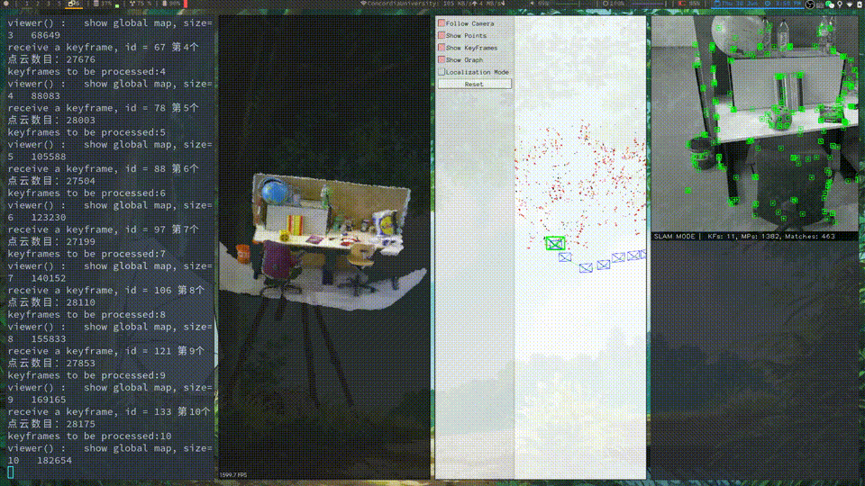
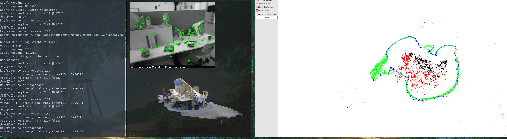

# `RGB-D` camera dense mapping based on `ORB_SLAM2`

[chinese version](./README_CN.md)

## Preparation before starting

### Confirm the build environment

**Note:** Whether you are using `ubuntu18.04` or `ubuntu16.04`, it is strongly recommended to use the `PCL 1.7.2` version of the point cloud library

- The actual measurement of `pcl-1.8` installed by `ubuntu18.04` apt will cause a segmentation fault (of course, it may also be the reason why my computer software environment is more complicated~)
- To compile and install `pcl-1.7`, refer to [Compilation and installation steps on the pcl official website](https://github.com/PointCloudLibrary/pcl)

### Prepare the dataset

We use the `RGB-D` dataset of `TUM`: download it and put it under `TUM_dataset/` in the project directory, if not, create a new one
For details, please refer to the path of the command in the `run_rgbd_dense_map.bash` file.

### Prepare dictionary file

If there is no dictionary file, then go to download:
[dictionary file](https://github.com/raulmur/ORB_SLAM2)

## compile the entire project

```bash
     chmod +x build.sh
     ./build.sh
````

### Compile only `ORB_SLAM2 Dense_Map`

```bash
    mkdir build
    cd build
    cmake..
    make -j
````

## run rgbd dense map

```bash
    bash run_rgbd_dense_map.bash
````

running result:


The point cloud adjustment after the loopback is detected, the text output in the red box is the prompt information after the point cloud adjustment is completed after the loopback, see the code for details:


## Code ideas

- Add a `PointCloudMapping` class and create a thread to process and display the point cloud information of `keyframe`
- The `Tracking` thread inserts keyframes into the `PointCloudMapping` keyframe queue
- The `LoopClosing` thread will notify `PointCloudMapping` to adjust the point cloud after a loop is detected.
